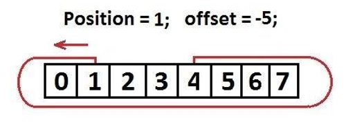

The `OffsetArrayList` class is a custom implementation of an `ArrayList` with an adjustable **offset**, meaning valid indices start at a specified number rather than `0`. It allows adding, removing, and modifying elements while automatically resizing the internal array when needed. The class also includes methods for shifting elements when inserting or deleting items, ensuring the list remains properly structured. It throws exceptions for invalid operations, such as accessing out-of-bounds indices. Additionally, a built-in `unitTest()` function verifies its correctness, and the `main()` method demonstrates its functionality by adding, removing, and printing elements.
 

