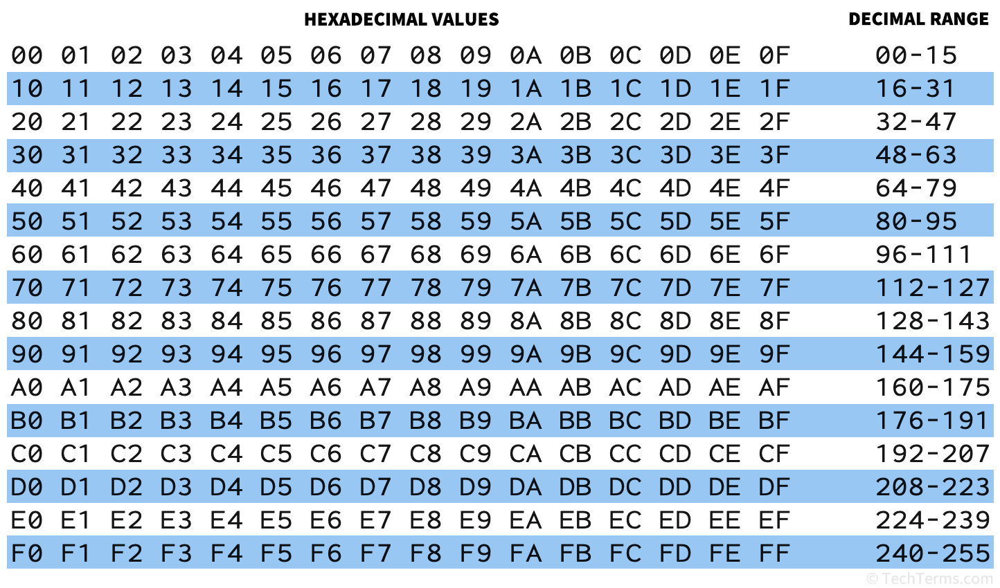

  

My hexadecimal project explores the base-16 numbering system, which is widely used in computing and digital electronics. Hexadecimal numbers range from 0 to F, representing values from 0 to 15, and how they are used in things like memory addresses, color codes, and data storage. I also show real-world examples, such as HTML color codes (#FF5733) and how hexadecimal is used in programming. My project includes simple explanations and conversion methods between decimal, binary, and hexadecimal to help make these concepts easier to understand. Overall, I highlight why hexadecimal is important in technology and how it simplifies complex binary data.
